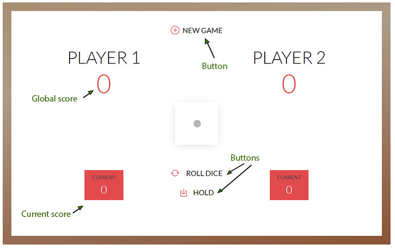

#  Dice game

This is a second project for Studi Graduate Fullstack course.

For this project I have used:

- HTML
- SASS
- JAVASCRIPT

## Game rules

- It is a two game players.
- To start a game, click **NEW GAME** button.
- A player rolls a dice as many times as he wishes with **ROLL DICE** button. Each result get added to his current score.
- But, if the player get a **1**, all his current points gets lost, and the next player rolls the dice.
- The player can choose to **"HOLD"**, it means that his current points gets added to his global score. After that, it's the next player's turn.
- The first player to reach 100 on global score wins the game.

## Screenshot

# 
